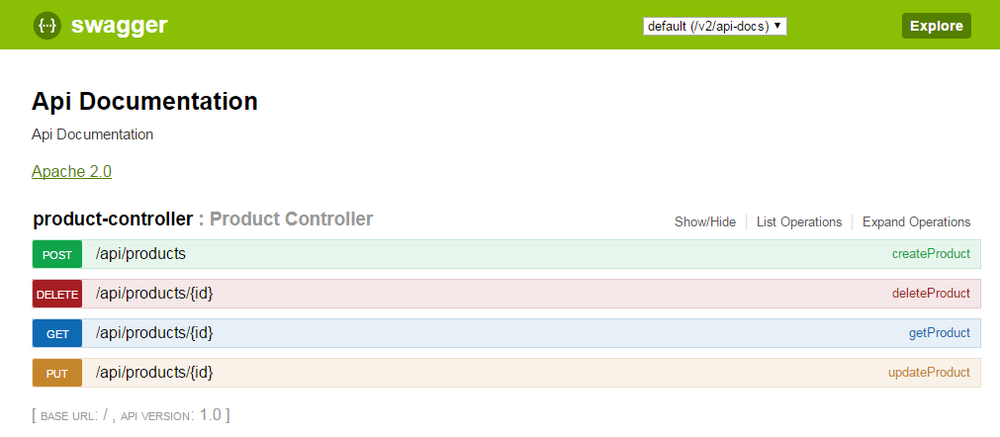
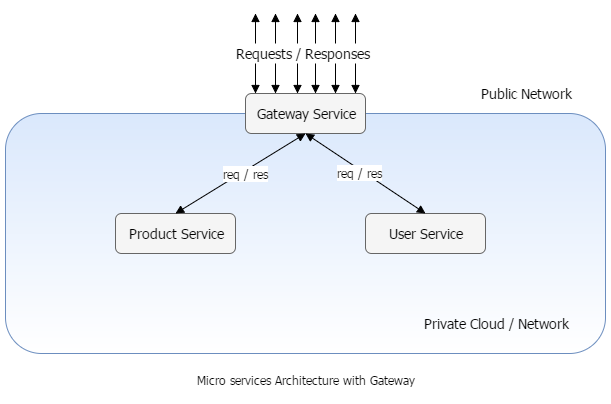

# swagger-zuul-sample

This repository integrates following into micro services architechture based on spring boot.
* Swagger for automatic nice doc generation of the rest apis exposed.
* Zuul for implementing a gateway service for single point access to the platform.

## Swagger
It automatically generates a swagger ui html page with all the rest apis in the application. It also provides a rest client to hit request to micro services directly from the swagger ui page.  

## Zuul
It is used to proxy requests to other micro services and returns the response. In a micro services architechture, there may be many micor services, but we may not expose all of them to public. There may be some security reasons, there may be some private apis. Using Zuul we cater this issue by exposing only one gateway service to public. 
Gateway Service proxies the request to different micro services based on the request url and relays the response back to consumers. Now we need to secure only one micro service from the public. We can use high security while communication between public and gateway service, whereas we may use less security while communication among gateway and other micro services. 

